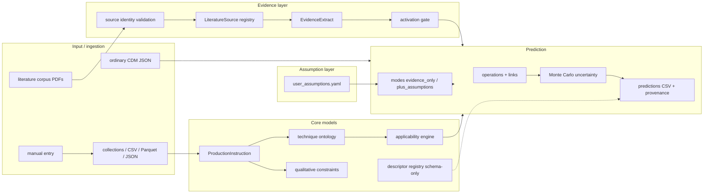
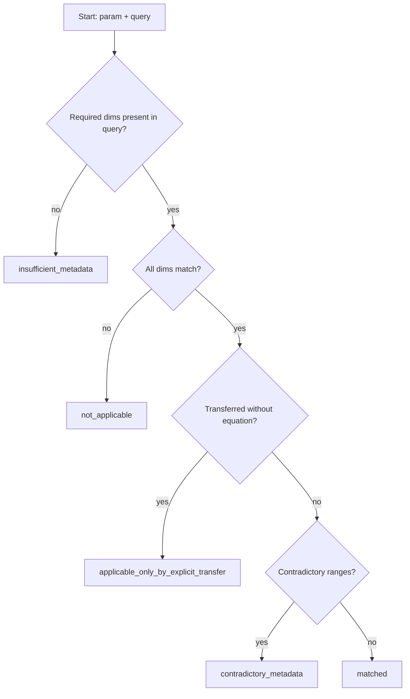
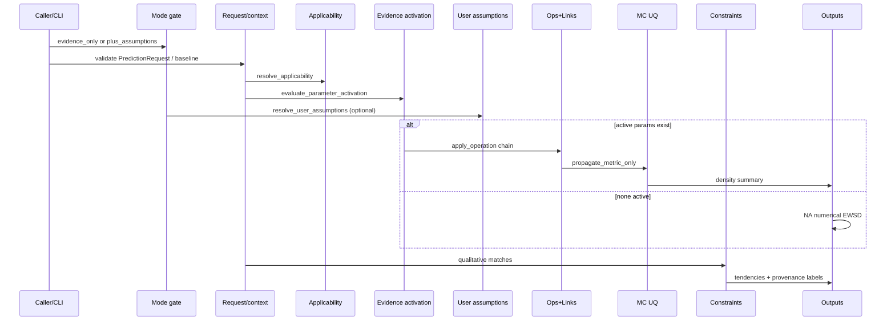

# Technical Guide

**Repository:** String Technique Density Model  
**Guide version:** 1.0.0 (implementation snapshot 2026-07-23)  
**Audience:** musicologists, musical-acoustics researchers, data scientists, software engineers, maintainers  
**Math rendering:** All formulas use LaTeX for [StackEdit](https://stackedit.io) / MathJax — inline `$...$` and display `$$...$$`.

> **Writing rule.** This guide describes the system **as implemented**. Capabilities that are schema-only, inactive, qualitative-only, or absent are labelled accordingly. Formulas not present in code are marked **Not currently implemented.**

---

## 1. Purpose and scientific scope

### Research problem

The repository estimates how **specialised bowed-string production states** (harmonics, bow-contact region, mute state, multiphonics, etc.) relate to ordinary arco baselines expressed as precomputed **EWSD** (acoustic-balanced) scalar scores, while keeping **literature evidence** and **user numerical assumptions** strictly separated.

### Technique, acoustics, perception, texture, EWSD

Four analytical levels are modelled separately (`analytical_levels`):

1. **Production instruction** — what the player physically does.
2. **Acoustic result** — measurable descriptors / scores.
3. **Perceptual organization** — fusion, segregation, streaming, etc.
4. **Musical-textural function** — foreground/background, accumulation, etc.

Technique **labels do not imply invariant timbres**: the same verbal label (e.g. “sul ponticello”) can combine with different left-hand regimes, mute states, dynamics, instruments, and measurement domains.

### Evidence vs user assumptions

| Mode | Default? | Numerical EWSD from literature params | Numerical EWSD from user assumptions |
|------|----------|----------------------------------------|--------------------------------------|
| `evidence_only` | **Yes** | Only if an activated, evidence-compatible parameter exists (currently **none**) | No |
| `evidence_plus_user_assumptions` | No | Same gate | Yes, if dual activation gate passes |

### What the software can and cannot currently calculate

| Capability | Status |
|------------|--------|
| Structured `ProductionInstruction` + migration | **Implemented and active** |
| $\beta$ from lengths | **Implemented and active** |
| Artificial-harmonic interval $\leftrightarrow$ order validation | **Implemented and active** |
| Qualitative constraint matching | **Implemented and active** |
| Literature identity + extract registry | **Implemented and active** |
| Monte Carlo density transforms (ops + links) | **Implemented**, but **inactive** without active parameters/assumptions |
| EWSD recomputation from audio/spectrum | **Not currently implemented** |
| Descriptor formulas (centroid, HNR, …) | **Implemented backend** (`descriptor_backend_v1`; some still unsupported) |
| Mute mass $\rightarrow$ attenuation law | **Not currently implemented** (explicitly refused) |
| Harmonic sounding-pitch from $n\cdot f_0$ | **Not currently implemented** |
| Schelleng stable-motion boundary | **Not currently implemented** |

**EWSD formula in this repository.** The metric module applies the identity

$$
\Phi(D) = D
$$

where $D$ is a **precomputed** EWSD acoustic-balanced scalar. This repository does **not** recompute EWSD from spectra. Direct technique-to-EWSD literature mappings are **inactive** (`n_active_density_parameters == 0`).

Relevant files: `configs/density_metric.yaml`, `src/string_technique_model/density/metric.py`.

---

## 2. System architecture




**Data-flow direction.** Ingestion $\rightarrow$ production/ontology normalisation $\rightarrow$ applicability + evidence/assumption lookup $\rightarrow$ (optional) link/operation transforms $\rightarrow$ labelled outputs + reports. Qualitative constraints never invent EWSD numbers.

| Layer | Main files | Main responsibility | Output |
|-------|------------|---------------------|--------|
| Ingestion | `collections/`, `manual_entry/`, `io/parquet_preflight.py` | Load ordinary / measured tables | Canonical frames |
| Production | `production/` | Structured technique state | `ProductionInstruction` |
| Ontology | `ontology/`, `configs/technique_ontology.yaml` | Allowed values, interval–order map | `OntologyConfig` |
| Literature | `literature/`, `configs/literature_*.yaml` | Sources, extracts, activation | Ledger / matrix / reports |
| Descriptors | `descriptors/`, `configs/acoustic_descriptors.yaml` | Registry only | Capability = unavailable |
| Constraints | `constraints/`, `configs/qualitative_acoustic_constraints.yaml` | Qualitative tendencies | `ConstraintMatch` list |
| Assumptions | `assumptions/`, `configs/user_assumptions.yaml` | User numerical coeffs | Activated param dicts |
| Prediction | `prediction/` | Modes, ops, links, MC | Prediction CSV / NA |
| Analytical levels | `analytical_levels/` | Level separation + stub inference | Assessments |
| CLI / reports | `cli/`, `reports/` | Operator interface | Markdown / CSV |

Principal package root: `src/string_technique_model/`.

---

## 3. Conceptual model

### Level 1 — Production instruction

**Data model:** `ProductionInstruction` (`production/models.py`).  
Composable axes: `left_hand`, `bow_contact`, `mute`, `bowing`, `timbre_execution_target`, `performance_context`.  
**May not infer:** fixed timbre, EWSD value, textural function.

### Level 2 — Acoustic result

**Data model:** `AcousticDescriptorObservation` + precomputed EWSD scalars.  
Descriptor **formulas:** Not currently implemented (registry schema-only).  
EWSD values enter as upstream scalars, not as derived spectra.

### Level 3 — Perceptual organization

**Data model:** `PerceptualOrganizationAssessment`.  
Categories include `fusion`, `segregation`, `streaming`, `stratification`, `source_identification_ambiguity`, `salience`, `insufficient_context`.  
Requires contextual variables; not inferred from a technique label alone.

### Level 4 — Musical-textural function

**Data model:** `TexturalFunctionAssessment`.  
`infer_textural_function` is a **conservative stub**: returns `insufficient_context` unless enough grouping context is supplied; never invents EWSD.

### Explicit non-implications

- Notation does **not** guarantee a fixed acoustic result.
- An acoustic descriptor does **not** determine a textural function.
- Perceptual/textural conclusions require contextual variables (`assert_level_separation`).

### Worked conceptual example

**Target:** cello artificial harmonic + sul ponticello + standard performance mute.

```json
{
  "schema_version": "production_instruction_v1",
  "legacy_technique_label": null,
  "left_hand": {
    "left_hand_regime": "artificial_harmonic",
    "harmonic_type": "artificial",
    "touched_interval": "P4",
    "harmonic_order": 4,
    "notation_represents": "touched_pitch",
    "string_name": "A"
  },
  "bow_contact": {
    "category": "sul_ponticello",
    "excitation_region": "speaking_string",
    "relative_bow_bridge_distance_beta": null,
    "bow_bridge_distance_m": null,
    "speaking_length_m": null
  },
  "mute": {
    "state": "on",
    "category": "standard_performance_orchestral"
  },
  "bowing": { "dynamic": "mf" },
  "timbre_execution_target": "ordinary_colour",
  "performance_context": { "instrument": "vlc" }
}
```

This is a **structured production state**, not one flat technique enum cell.

---

## 4. Repository and package map

### Layout (principal)

```
src/string_technique_model/
  production/     # ProductionInstruction, beta, harmonics, mute, migration
  ontology/       # YAML loader
  literature/     # sources, extracts, activation, identity, corpus
  constraints/    # qualitative engine
  descriptors/    # registry (unimplemented formulas)
  applicability/  # unified resolver
  assumptions/    # user numerical assumptions
  prediction/     # pipeline, ops, links, UQ, modes, from_ordinary
  analytical_levels/
  recognition/    # TechniqueRecognitionResult (no EWSD)
  measurement_domains/
  collections/ baseline/ density/ models/ metrics/ io/ cli/ manual_entry/
configs/          # YAML authority files
literature/corpus/
reports/ tests/ data/
```

### Module roles (operational)

| Package | Public symbols (selected) | Callers | Side effects |
|---------|---------------------------|---------|--------------|
| `production` | `migrate_legacy_technique_record`, `compute_beta`, `validate_bow_contact`, `validate_harmonic_interval_order`, `normalize_mute_mass`, models | CLI, prediction, tests | None (pure) |
| `literature` | `build_literature_layer`, identity/registry helpers | `literature` CLI | Writes reports/CSV when not dry-run |
| `prediction` | `build_predictions`, `predict_from_ordinary` | `predict` CLI | Writes `outputs/predictions/` |
| `assumptions` | `resolve_user_assumptions`, registry loaders | prediction, assumptions CLI | `activate`/`deactivate` rewrite YAML |
| `constraints` | `QualitativeConstraintEngine` | from_ordinary, tests | None |
| `applicability` | `resolve_applicability` | literature activation, prediction | None |
| `density` | `DensityMetric.phi` | prediction pipeline | None |
| `io` | `check_parquet_engine` | collection loaders | None |

Exceptions of note: `OperationError`, `LinkError`, `AssumptionConflictError`, `LiteratureValidationError`, `ValueError` on invalid $\beta$ lengths.

---

## 5. Data schemas

All models below are Pydantic with `extra="allow"` unless noted. Serialization: JSON/YAML via `model_dump()`.

### `ProductionInstruction` — `production.models.ProductionInstruction`

| Field | Type | Required | Default | Units |
|-------|------|----------|---------|-------|
| `schema_version` | str | no | `production_instruction_v1` | — |
| `legacy_technique_label` | str\|None | no | null | — |
| `left_hand` | HarmonicInstruction\|None | no | null | — |
| `bow_contact` | BowContactInstruction\|None | no | null | — |
| `mute` | MuteInstruction\|None | no | null | — |
| `bowing` | BowingConditions\|None | no | null | — |
| `timbre_execution_target` | TimbreExecutionTarget\|None | no | null | — |
| `performance_context` | PerformanceContext\|None | no | null | — |
| `provenance` | dict\|None | no | null | — |
| `missingness` | dict\|None | no | null | — |
| `migration_warnings` | list\|None | no | null | — |

### `HarmonicInstruction`

| Field | Type | Notes |
|-------|------|-------|
| `left_hand_regime` | LeftHandRegime | required in practice for harmonic paths |
| `harmonic_type` | HarmonicType\|None | `natural`/`artificial`/`half`/`multiphonic` |
| `harmonic_order` | int\|None | allowed $\{2,3,4,5,6\}$ |
| `touched_interval` | str\|None | P4/M3/m3/P5 (+ aliases) |
| `stopped_*` / `touched_*` / `sounding_*` | name/midi | **no auto derivation of sounding** |
| `allow_order_inference` | bool | default `false` |
| multiphonic-related optional fields | — | also mirrored on `MultiphonicInstruction` |

### `BowContactInstruction`

| Field | Type | Unit |
|-------|------|------|
| `category` | BowContactCategory\|None | nominal |
| `relative_bow_bridge_distance_beta` | float\|None | dimensionless |
| `bow_bridge_distance_m` | float\|None | m |
| `speaking_length_m` | float\|None | m |
| `excitation_region` | ExcitationRegion\|None | nominal |
| `motion_regime` | MotionRegime\|None | nominal |
| `bow_position_ratio_deprecated` | float\|None | legacy alias of $\beta$ |

### `MuteInstruction`

| Field | Type | Unit |
|-------|------|------|
| `state` | MuteState\|None | — |
| `category` | MuteCategory\|None | — |
| `mute_mass_g` | float\|None | g |
| `mass_raw` | str\|None | original text |
| `material`, `geometry`, `bridge_contact_area`, … | str\|None | — |

### `BowingConditions`

`force_n` [N], `velocity_m_s` [m s$^{-1}$], `articulation`, `hair_inclination`, `contact_area_descriptor`, `dynamic`.

### `PerformanceContext`

Instrument, pitches (written/sounding), string, $f_0$ as `fundamental_frequency_hz` [Hz], register, performer/instrument IDs, recording geometry, variance fields.

### `MultiphonicInstruction`

Schema for stored/source-derived multiphonic configurations. **Does not calculate multiphonics from first principles.** Fields include `touching_position_ratio`, `equivalent_touching_position_ratio`, `principal_harmonic_components`, `observed_partials`, `chain_identifier`, `mutation_relationship`, `establishment_time_s`, `stability`, dependencies, `source_reference`.

### Analytical levels

- `AcousticDescriptorObservation`: `descriptor_id`, `value`, `units`, `analysis_params`, `provenance`
- `PerceptualOrganizationAssessment`: `organization`, `required_context_fields`, `evidence`
- `TexturalFunctionAssessment`: `function`, `conditional_candidates`, …

### Literature

- `LiteratureSource` — citation + `evidence_status` + `local_file_path`
- `EvidenceExtract` — page-located claim fields + `curator_verification_status`
- `SourceIdentityEntry` — archive identity validation

### Assumptions

`UserAssumption` (`assumptions/models.py`): `assumption_id`, `name`, `instrument`, `technique`, `operation_type`, `reported_value`, `unit`, `numerical_scale`, `compatible_links`, `source_space`, `target_space`, `uncertainty_sd`, applicability fields, `active_for_density_prediction`, `literature_validated` (must remain `false`).

### Prediction

`PredictionRequest` (`prediction/requests.py`): `instrument`, `target_technique` (legacy four labels), pitches, mute/bow fields, `requested_backend` default `metric-only`, `target_metric_definition_id` default `ewsd_v1`.

There is no separate class named `PredictionResult`; prediction outputs are tabular rows + `PredictionBuildResult` / `FromOrdinaryResult` dataclasses/objects from the pipeline modules.

### Recognition / measurement domains

- `TechniqueRecognitionResult` — MIR labels; `claims_ewsd` always false
- Measurement domain IDs: `radiated_audio`, `bridge_force`, `string_velocity_at_bow`, `bridge_mobility`, `body_acceleration`, `unresolved`

---

## 6. Technique ontology

**Authority file:** `configs/technique_ontology.yaml`  
**Loader:** `ontology/loader.py::load_ontology`

### Distinctions (implemented labels)

| Concept | Representation | Kind |
|---------|----------------|------|
| Ordinary stopped | `left_hand_regime=ordinary_stopped` | nominal |
| Natural / artificial / half harmonic | regimes + `harmonic_type` | nominal |
| Harmonic glissando | `natural_harmonic_glissando` / `artificial_harmonic_glissando` | nominal |
| Multiphonic | `left_hand_regime=multiphonic` + `MultiphonicInstruction` | nominal / structured |
| Flautando | `timbre_execution_target=flautando` | **perceptual/execution target**, not a bow-contact category |
| Sul tasto … sul ponticello continuum | `BowContactCategory` | ordered nominal on speaking string |
| Directly on bridge / afterlength | `excitation_region` | **outside** continuum |
| Mute types | `MuteCategory` (+ legacy aliases) | nominal |
| $\beta$ | continuous dimensionless | continuous |

**Composable:** left-hand $\times$ bow-contact $\times$ mute $\times$ bowing $\times$ timbre target.  
**Not mutually exclusive as a single flat enum** (legacy 4×4 is compatibility only: `legacy_cell_count()`).

### Legacy migration examples

`production/migration.py::migrate_legacy_technique_record`

1. `technique=sul_ponticello` $\rightarrow$ `bow_contact.category=sul_ponticello`, `left_hand=ordinary_stopped` (unless harmonic fields present).
2. `technique=artificial_harmonic`, `touched_interval=P4` $\rightarrow$ `left_hand` with order 4 when consistent.
3. `technique=con_sordino`, `mute_type=orchestral` $\rightarrow$ `mute.category=standard_performance_orchestral`.

---

## 7. Mathematical notation and conventions

| Symbol | Meaning | Unit | Code field | Valid domain | Source |
|--------|---------|------|------------|--------------|--------|
| $\beta$ | Relative bow–bridge distance | 1 | `relative_bow_bridge_distance_beta` | typically $(0,1)$ on speaking string | Schoonderwaldt extracts; ontology |
| $d_b$ | Bow–bridge distance | m | `bow_bridge_distance_m` | $\ge 0$ | production |
| $L$ | Speaking length | m | `speaking_length_m` | $> 0$ | production |
| $F_b$ | Bow force | N | `force_n` / `bow_force_n` | $\ge 0$ if set | production / request |
| $v_b$ | Bow velocity | m s$^{-1}$ | `velocity_m_s` | real | production |
| $f_0$ | Fundamental frequency | Hz | `fundamental_frequency_hz` | $> 0$ if set | context |
| $D$ | Precomputed EWSD score | dimensionless | `baseline_value` / density samples | empirically $\sim 0$–$100$ | upstream EWSD |
| $\eta$ | Link-space value | link-dependent | internal arrays | see §16 | `prediction/links.py` |
| $r$ | Multiplicative ratio | 1 | `reported_value` for ratio ops | $> 0$ | ops / assumptions |
| $\delta$ | Additive density difference | same as $D$ | `reported_value` | real | ops |
| $x_{\mathrm{dB}}$ | Level difference | dB | literature only | real | **not** density op |
| $m$ | MIDI note number | 1 | `*_midi` | real | `pitch_name_to_midi` |
| $m_{\mathrm{mute}}$ | Mute mass | g | `mute_mass_g` | $\ge 0$ if set | mute normalizer |

Spectral centroid, spectral slope, HNR, flux, loudness (sones), etc. appear as **descriptor IDs only**; no implemented computation symbols.

---

## 8. Bow-contact calculations

### Formula name: Relative bow–bridge distance $\beta$

**Purpose:** Dimensionless contact position on the speaking length.

**Equation:**

$$
\beta = \frac{d_b}{L} = \frac{\texttt{bow\_bridge\_distance\_m}}{\texttt{speaking\_length\_m}}
$$

| Symbol | Definition | Unit | Code field |
|--------|------------|------|------------|
| $\beta$ | Relative bow–bridge distance | 1 | `relative_bow_bridge_distance_beta` |
| $d_b$ | Distance bow to bridge | m | `bow_bridge_distance_m` |
| $L$ | Speaking length | m | `speaking_length_m` |

**Applicability:** Speaking-string excitation; continuum categories.  
**Assumptions:** Uniform geometric ratio; no instrument-specific threshold map (`bow_contact_beta_thresholds: null`).  
**Implementation:** `src/string_technique_model/production/bow_contact.py::compute_beta`  
**Input validation:** $L > 0$; $d_b \ge 0$; else `ValueError`.  
**Contradiction check:** if both $\beta$ and lengths supplied,

$$
\lvert \beta - d_b/L \rvert \le \tau,\quad \tau = 10^{-6}
$$

(`contradiction_tolerance_abs` in ontology).  
**Output:** float $\beta$.  
**Uncertainty:** Not currently implemented for $\beta$.  
**Scientific source:** Definition aligned with Schoonderwaldt 2009 extracts; not a universal timbre law.  
**Limitations:** $\beta$ alone does **not** determine timbre; force, velocity, string, pitch, dynamic, instrument, measurement domain interact.  
**Schelleng boundary logic:** Not currently implemented.

**Worked example:**

$$
d_b = 0.03\,\mathrm{m},\quad L = 0.60\,\mathrm{m},\quad \beta = \frac{0.03}{0.60} = 0.05
$$

**Tests:** `tests/test_pdf_soa_integration.py`, bow-contact related cases; primary-source ingestion tests for domain separation.

---

## 9. Harmonic calculations

### Interval $\leftrightarrow$ order map (implemented)

From `configs/technique_ontology.yaml` via `ontology/loader.py` / `production/harmonics.py`:

| Interval | Order $n$ |
|----------|-----------|
| Perfect fourth (P4) | $4$ |
| Major third (M3) | $5$ |
| Minor third (m3) | $6$ |
| Perfect fifth (P5) | $3$ |

Allowed orders: $n \in \{2,3,4,5,6\}$. Global `allow_order_inference: false`.

**Validation:** `validate_harmonic_interval_order(touched_interval, harmonic_order, ...)`.

### Sounding frequency / MIDI from harmonic order

**Not currently implemented.**

The physically expected relations

$$
f_{\mathrm{sounding}} = n\, f_{\mathrm{stopped}}
$$

$$
m_{\mathrm{sounding}} = m_{\mathrm{stopped}} + 12\log_2 n
$$

are **not** coded. Fields `sounding_pitch_*` may be stored if supplied; they are not computed.

### Ordinary pitch-name $\rightarrow$ MIDI (implemented)

**Purpose:** Map scientific pitch names to MIDI for baseline cells.

$$
m = 12\,(o + 1) + p
$$

where $o$ is octave digit and $p\in\{0,\ldots,11\}$ is pitch class (C$=0$, …, B$=11$), with accidental $\#\Rightarrow +1$, $\mathrm{b}\Rightarrow -1$.

**Implementation:** `baseline/pitch.py::pitch_name_to_midi`  
**Tests:** baseline / from_ordinary suites.

---

## 10. Multiphonic representation

**Status:** Schema + distinctness helper; **no first-principles predictor**.

- Store source-derived configurations in `MultiphonicInstruction`.
- `assert_distinct_from_harmonics` rejects conflation with natural/artificial/half harmonics, double stops, harmonic glissandi.
- Fallowfield TEMPO article registered; **no invented fingering charts**.

Touching-position symmetry, chains, mutations: fields only. Prediction of multiphonic pitch sets: **Not currently implemented.**

---

## 11. Mute model

**Model:** `MuteInstruction` + migration aliases + Evangelista dataset **stubs**.

Categories (additive): performance / light practice / heavy practice / historical / adjustable_partial / legacy orchestral & hotel labels / none / unresolved.

### Formula name: Mute mass $\rightarrow$ grams

**Purpose:** Normalise textual masses to grams.

If a unit token is present:

$$
m_{\mathrm{mute}} = a \cdot u
$$

with $u\in\{1$ (g), $10^{-3}$ (mg), $10^{3}$ (kg)$\}$.

**Bare numbers without unit:** `mute_mass_g = null` + warning (not silently assumed grams).

**Implementation:** `production/mute.py::normalize_mute_mass`  
**Attenuation law** $A=f(m_{\mathrm{mute}})$: **Not currently implemented** (Evangelista extracts forbid universal mass law).  
**Loudness/LTAS $\rightarrow$ EWSD:** **Not currently implemented.**

Dataset stubs: `configs/datasets/evangelista_freire_2025_mute_table.yaml` (empty rows), Zenodo `external_unresolved`, LTAS profile nullable fields.

---

## 12. Acoustic descriptors

**Registry:** `configs/acoustic_descriptors.yaml` (v`0.5.0-descriptor-backend`).  
**Analysis profile:** `configs/analysis_profiles/default_descriptor_v1.yaml` — every parameter is recorded on `DescriptorResult` (no silent defaults).  
**Dispatch:** `descriptors.engine.compute_descriptor` / typed attenuation helpers.

`ewsd_compatibility` remains `incompatible_without_activated_mapping` for all descriptors.  
Technique-model capability `descriptor_extraction` stays unavailable (backend is separate from EWSD models).

### Spectral centroid (`DESC_SPECTRAL_CENTROID`, method `spectral_centroid_v1`)

$$
C = \frac{\sum_k f_k W_k}{\sum_k W_k}
$$

with configurable $W_k\in\{\mathrm{magnitude},\mathrm{power}\}$ (explicit; never switched silently).  
**Measurement domain:** must not equate `string_velocity_at_bow` / `bridge_force` centroids with `radiated_audio` (Schoonderwaldt; comparison → `not_comparable`).

### Spectral slope (`DESC_SPECTRAL_SLOPE`, method `spectral_slope_logfreq_db_linreg_v1`)

OLS slope of **dB-power** versus **log10 frequency**, DC excluded, band from profile (`min_hz`–`max_hz`). Method ID must be preserved on outputs.

### HNR (`DESC_HNR`, method `hnr_spectral_mask_v1`)

Spectral-mask harmonic vs residual power ratio in dB. **Not** autocorrelation HNR and **not** harmonic-model residual HNR.

### Spectral flux (`DESC_SPECTRAL_FLUX`, method `spectral_flux_l1_halfwave_v1`)

Mean L1 half-wave-rectified difference of sum-normalized magnitude frames.

### Frame-level spectral variance (`DESC_FRAME_SPECTRAL_VARIANCE`)

Temporal variance of per-frame spectral centroids (distinct from within-frame spectral spread).

### LTAS (`DESC_LTAS`)

Vector object (frequencies + mean power spectrum). Evangelista & Freire source profile is a **metadata stub** until verified analysis settings are curated — do not claim comparability.

### Attenuation (`DESC_ABSOLUTE_ATTENUATION`)

Typed functions: $20\log_{10}(A_2/A_1)$, $10\log_{10}(P_2/P_1)$, and inverses. Sones ≠ dB; bridge-mobility ≠ radiated SPL.

### Partials (`DESC_PARTIAL_SALIENCE`, `DESC_PITCH_COMPONENT_COUNT`)

Configurable peak detection / thresholds. Synthetic multi-sinusoids are numerical proxies, **not** physical cello multiphonics.

### Still unsupported (scope safeguard only)

`DESC_TEMPORAL_MODULATION`, `DESC_ATTACK_TIME`, `DESC_LOUDNESS`, `DESC_FUNDAMENTAL_SALIENCE`, `DESC_UPPER_PARTIAL_ENERGY_RATIO`, `DESC_BRIDGE_MOBILITY`, `DESC_INTER_PLAYER_VARIABILITY`.

`list_implemented_descriptors()` returns the implemented registry subset (non-empty).

**Real-audio validation:** absent locally; no ecological-validity claim; no silent downloads.

---

## 13. Decibel and ratio calculations

Typed descriptor helpers **and** prediction helpers exist; **must not** be used as EWSD density operations:

$$
\frac{A_2}{A_1} = 10^{x_{\mathrm{dB}}/20}
$$

$$
\frac{P_2}{P_1} = 10^{x_{\mathrm{dB}}/10}
$$

**Implementation:** `descriptors/attenuation.py` (typed) and `prediction/operations.py::amplitude_ratio_from_db`, `power_ratio_from_db`  
**Density ops named as dB gains:** raise `OperationError` (`refuse_db_as_density_multiplier` path in literature activation).  
Meyer-class dB dynamic ranges remain **indirect proxies**, not density multipliers.

---

## 14. Density and EWSD

### Formula name: Density metric identity $\Phi$

**Purpose:** Canonical metric transform for prediction (collection-agnostic).

$$
\Phi(D) = D
$$

| Symbol | Definition | Unit | Code field |
|--------|------------|------|------------|
| $D$ | Precomputed EWSD acoustic-balanced score | dimensionless | baseline / samples |
| $\Phi$ | Metric map | same as $D$ | `DensityMetric.phi` |

**Implementation:** `density/metric.py` + `configs/density_metric.yaml`  
**Upstream:** SSA/EWSD pipeline identifiers recorded in YAML; **not recomputed here**.  
**Active technique-parameter mappings:** none.  
**Event density / note counts / centroid:** not equivalent to EWSD unless a validated mapping exists (none active).

If no active parameter/assumption applies, prediction cells report **NA** numerical EWSD technique estimates with qualitative attachments where available.

---

## 15. Prediction operations

**Module:** `prediction/operations.py::apply_operation`

| Operation | Equation | Spaces | Link notes |
|-----------|----------|--------|------------|
| `multiplicative_ratio` | $D' = D\cdot r$ | density→density | if log link: $\eta' = \eta + \ln r$ |
| `additive_difference` | $D' = D + \delta$ | density→density | then $\eta' = g(D')$ |
| `additive_log_difference` | $\eta' = \eta + x$, $D' = e^{\eta'}$ | log-density | requires log-compatible path |

**Incorrect pattern (not used for additive $\delta$ in density space):**

$$
\eta' = \eta + \delta \quad\text{(forbidden when }\delta\text{ is density-space)}
$$

The code **re-links** after density-space addition.

**Rejected / unimplemented ops:** `decibel_*` as density ops; `frequency_dependent_transfer`; `spectral_slope_change`.

### Compatibility (implemented)

| Operation | identity | log | logit |
|-----------|----------|-----|-------|
| multiplicative_ratio | yes | yes ($r>0$) | yes if $D'$ in $(0,1)$ |
| additive_difference | yes | yes via re-link | domain-limited |
| additive_log_difference | no (log-space) | yes | no |

---

## 16. Link functions

**Module:** `prediction/links.py`  
**Config:** `configs/model_links.yaml`  
Default for `ewsd_v1`: **log**.

### Identity

$$
g(x) = x,\qquad g^{-1}(\eta) = \eta
$$

### Log

$$
g(x) = \ln x,\qquad g^{-1}(\eta) = e^{\eta}
$$

Safeguard: $x \leftarrow \max(x, \varepsilon)$ with $\varepsilon = 10^{-12}$ if needed.

### Logit

$$
g(p) = \ln\frac{p}{1-p},\qquad g^{-1}(\eta) = \frac{1}{1+e^{-\eta}}
$$

Clip to $(\varepsilon, 1-\varepsilon)$, $\varepsilon=10^{-9}$.

### Probit

Present in config; **disabled** unless explicitly `enabled: true`.

---

## 17. Applicability engine

**Module:** `applicability/resolver.py::resolve_applicability`

Statuses: `matched`, `not_applicable`, `insufficient_metadata`, `applicable_only_by_explicit_transfer`, `contradictory_metadata`.

Decision order (simplified): instrument/technique identity $\rightarrow$ declared applicability dimensions vs query $\rightarrow$ transfer flag $\rightarrow$ contradictory ranges.



**Example matched:** violin, `con_sordino`, mute type within param’s `applicable_mute_type`.  
**Example rejected:** heavy-practice mute query against orchestral-only parameter (`mute_type_mismatch` in literature activation layer).

---

## 18. Qualitative constraint engine

**Config:** `configs/qualitative_acoustic_constraints.yaml`  
**Engine:** `constraints/engine.py::QualitativeConstraintEngine`

Tendencies: `increase`, `decrease`, `redistribute`, `variable`, …  
Strengths: `mechanism`, `recurrent_tendency`, `context_dependent`, `instrument_specific_tendency`.  
All constraints: `numerical_prediction_allowed: false`.

`evaluate(..., request_density_prediction=True)` $\rightarrow$ status `numerical_prediction_not_allowed`.  
**A qualitative constraint does not generate an EWSD number.**

---

## 19. Evidence and literature ingestion

Workflow:

1. Locate PDF under archive / `literature/corpus/`.
2. Hash (SHA-256).
3. Read internal title/author/year/DOI/ISBN (not filename).
4. Detect duplicates by hash.
5. Assign `validation_status` in `configs/source_identity_validation.yaml`.
6. Register `LiteratureSource` if ingestible.
7. Add page-located `EvidenceExtract` (curator-validated).
8. Rebuild matrix/ledger; activation gate decides density usability.

Statuses: `verified_identity`, `partial_identity_match`, `duplicate_file`, `rejected_file_identity_mismatch`, `insufficient_metadata`.

Filename identity alone is **insufficient** (`reject_filename_only_claim`).

---

## 20. Evidence activation rules

`literature/activation.py::evaluate_parameter_activation` requires (all):

- verified local source + validated extract with location;
- complete operation/scale/unit;
- non-prohibited status;
- non-dB-as-multiplier;
- density mapping in activating set;
- applicability `matched`;
- curator `active_for_density_prediction: true`;
- no transfer without equation.

**Current package:** zero active density parameters.  
Secondary synthesis numerics (SOA PDF) remain inactive pending primary verification.

---

## 21. User numerical assumptions

**Config:** `configs/user_assumptions.yaml` (registry currently **empty**).  
**Models:** `assumptions/models.py::UserAssumption`  
**Modes:** `prediction/modes.py` — default `evidence_only`.

Dual gate:

1. Run mode `evidence_plus_user_assumptions` **or** `--activate-user-assumptions`.
2. Entry `active_for_density_prediction: true` with non-null `reported_value`.

Outputs labelled `assumption_based`; never `literature_validated`.  
Conflicts among overlapping active assumptions: `AssumptionConflictError` (explicit failure).

### YAML schema example (inactive template)

```yaml
assumption_id: UA_EXAMPLE_VLN_SUL_PONT_MF_RATIO
name: example_violin_sul_ponticello_mf_ratio
instrument: vln
technique: sul_ponticello
operation_type: multiplicative_ratio
reported_value: 1.2
unit: dimensionless_ratio
numerical_scale: density_ratio
compatible_links: [log, identity]
source_space: density
target_space: density
uncertainty_sd: 0.1
applicable_dynamic: mf
active_for_density_prediction: false
literature_validated: false
citation_or_rationale: "User-supplied example only"
```

---

## 22. Uncertainty

**Module:** `prediction/uncertainty.py` (no separate `uncertainty/` package).

**Baseline sampling:**

- if `baseline_sd>0`: $D^{(i)} \sim \mathcal{N}(\mu, \sigma)$
- else if `baseline_se>0`: $D^{(i)} \sim \mathcal{N}(\mu, \mathrm{SE})$
- else point mass at $\mu$

**Parameter draws:** normal / lognormal / uniform / point mass from ledger fields.

**Transfer noise (only if configured $\sigma_t>0$):**

$$
\eta^{(i)} \leftarrow \eta^{(i)} + \varepsilon^{(i)},\quad \varepsilon^{(i)}\sim\mathcal{N}(0,\sigma_t)
$$

Currently `transfers.uncertainty_sd: null` in prediction config — transfer UQ inactive.

**Analytical delta-method formulas:** Not currently implemented (Monte Carlo only).  
Missing uncertainty $\Rightarrow$ point mass (no hidden default SD such as $0.1$ for transfers).

---

## 23. Prediction pipeline

**Entry points:** `prediction/pipeline.py::build_predictions`, `prediction/from_ordinary.py::predict_from_ordinary`.



Default `n_draws=5000`, seed from config/CLI.  
Complete ordinary→technique path often ends in **NA** + qualitative CSV + `README_RESULT_BASIS`.

---

## 24. Capability reporting

`models/capabilities.py` / spectrum backend statuses include:

- `unavailable`
- `schema_only`
- `qualitative_constraints_only`
- `numerical_transform_available` — **not** currently true for spectrum path

Descriptor extraction capability: **unavailable**.  
Descriptor extraction $\neq$ transformed-audio generation.

---

## 25. Spectrum-aware processing

**Accepted keys (validation only):** `audio`, `fft`, `psd`, `stft`, `partial_amplitudes`, `band_energy`.  
**Numerical spectrum $\rightarrow$ density transform:** unavailable (`prediction.yaml`).  
`TechniqueModel.transform_spectrum` returns qualitative-only result with `ewsd_value=None`.

Do not read “spectrum-aware” as implying implemented spectral EWSD prediction.

---

## 26. Collections and data ingestion

Supported tabular paths via adapters: CSV, Parquet (optional engine), JSON/YAML configs.  
`io/parquet_preflight.py` checks engine availability; Parquet is **not** universally mandatory — preflight fails clearly if required and missing.  
Ordinary baselines: e.g. `data/baselines/violin_ordinary_cdm.json`.  
Missingness preserved; no silent zero-fills for density.

---

## 27. Manual entry and CLI

**Entry:** `python -m string_technique_model` (`cli/__init__.py`).

### Metadata-entry GUI

`python -m string_technique_model gui` launches a **table-first metadata application** (`gui_metadata/`).  
One row = one recording / file / excerpt / analysis unit. Core workflow: open/create → enter → validate → save/export.

- Pitch modes: `single_note`, `pitch_range`, `multiple_notes`, `open_string`, `unpitched_or_noise`, `unknown`.
- Full chromatic registry MIDI 0–127 (`pitch/registry.py`); instrument-range filter optional.
- Written and sounding pitch stored separately; derivations recorded.
- Technique combination: left-hand + bow-contact + mute + articulation (+ additional).
- Import/export: CSV, JSON, Parquet (when available); schema `metadata_entry_v1`.
- Prediction, literature, descriptors, and stress tools are under **Tools → Advanced** (`gui_legacy.py`), not on the main screen.

User guide: `docs/METADATA_ENTRY_GUI.md`.

| Command | Purpose |
|---------|---------|
| `run` / `estimate` / `lookup` | Legacy/high-level estimate paths |
| `gui` | Metadata-entry GUI (advanced tools via menu) |
| `collection …` | register/inspect/validate/import/list/compare |
| `baseline build\|inspect\|validate\|compare-methods` | Ordinary baseline construction |
| `literature …` | inventory, validate, matrix, ledger, corpus scan, register-source, add-extract, … |
| `predict build` | Predictions from baseline table |
| `predict from-ordinary` | CDM JSON → technique forecast |
| `predict validate-context` | Context validation |
| `predict inspect-parameters` | Parameter inspection |
| `predict explain` | Explain prediction id |
| `predict sensitivity` | Sensitivity scaffolding |
| `predict validation-status` | Status |
| `assumptions list\|validate\|show\|activate\|deactivate\|applicable\|audit` | Assumption registry |

### Examples

```bash
python -m string_technique_model predict from-ordinary --instrument vln --dynamic mf
python -m string_technique_model predict from-ordinary --instrument vln --dynamic mf --mode evidence-plus-user-assumptions --activate-user-assumptions
python -m string_technique_model assumptions audit --output reports/assumption_audit.md
python -m string_technique_model literature scan-corpus
```

---

## 28. Configuration files

See Appendix B. Dependency sketch:

```mermaid
flowchart TB
  ONT[technique_ontology.yaml] --> PROD[production validation]
  DESC[acoustic_descriptors.yaml] --> REG[descriptor registry]
  QC[qualitative_acoustic_constraints.yaml] --> ENG[constraint engine]
  SRC[literature_sources.yaml] --> LIT[literature layer]
  EV[literature_evidence_extracts.yaml] --> LIT
  PAR[literature_parameters.yaml] --> ACT[activation]
  MAP[literature_density_mappings.yaml] --> ACT
  ID[source_identity_validation.yaml] --> IDR[identity registry]
  DM[density_metric.yaml] --> PHI[DensityMetric]
  ML[model_links.yaml] --> LINK[links.py]
  PR[prediction.yaml] --> PIPE[prediction pipeline]
  UA[user_assumptions.yaml] --> ASS[assumptions]
  MD[measurement_domains.yaml] --> MDR[domains registry]
```



---

## 29. Validation and error handling

| Condition | Result |
|-----------|--------|
| `speaking_length_m <= 0` | `ValueError` in `compute_beta` |
| $\beta$ vs lengths disagree by $>\tau$ | validation errors list |
| Interval/order inconsistency | `ValidationResult` errors |
| Bare mute mass without unit | `mute_mass_g=null` + warning |
| dB density op | `OperationError` |
| Log link with nonpositive $D$ | floor safeguard / domain error paths |
| Conflicting active assumptions | `AssumptionConflictError` |
| Invalid instrument/technique on request | Pydantic `ValueError` |
| Unverified source for activation | `source_not_verified` reason |
| Missing Parquet engine when required | preflight failure |
| Filename-only identity | rejected / not ingestible |

---

## 30. Reproducibility and provenance

Recorded artefacts include: source_id, evidence_id, page range, DOI/ISBN, file SHA-256, config versions, assumption_ids_used, `result_basis`, `literature_validated`, `evidence_based`, run seed / `n_draws`, calculation mode.  
Corpus manifest: `literature/corpus/metadata/corpus_manifest.yaml`.  
Prediction manifests via `prediction/manifest.py`.

---

## 31. Testing strategy

| Requirement | Test file | Expected |
|-------------|-----------|----------|
| Source identity mismatch | `test_source_identity_validation.py` | reject Berio/Hann/Rimsky |
| Duplicate PDF hash | same | Fallowfield 2009=2020 |
| DOI present for articles | same | Schoonderwaldt/Evangelista/… |
| Meyer verified local | same | `verified_local_source` |
| Beta / harmonics / flautando | `test_pdf_soa_integration.py` | validation rules |
| Multiphonic distinct | `test_multiphonics_measurement_recognition.py` | helper rejects conflation |
| Measurement domains | same | required IDs load |
| Evangelista no mass law | `test_primary_source_ingestion.py` | extracts + no EWSD |
| Assumptions inactive default | `test_user_assumptions_and_from_ordinary.py` | evidence_only NA |
| Modes / CLI assumptions | `test_prediction_modes_and_assumptions_cli.py` | dual gate |
| Ops/links | `test_phase4_prediction_engine.py` | additive vs multiplicative |

**Latest executed results (document generation context):**

- `python -m pytest -q` → **253 passed**, 8 warnings  
- `python -m ruff check src tests` → clean when last checked in session  
- `python -m mypy src/string_technique_model` → **pre-existing errors** in `gui.py` / `cli/prediction.py` / `cli/literature.py` (not introduced by this guide)

---

## 32. Worked end-to-end examples

### Example 1 — Legacy migration

**Input:** `{ "instrument":"vln", "technique":"artificial_harmonic", "touched_interval":"P4", "dynamic":"mf" }`  
**Call:** `migrate_legacy_technique_record`  
**Output:** `ProductionInstruction` with `left_hand.harmonic_order=4` when validation consistent; legacy label preserved.

### Example 2 — Beta

$$
\beta = 0.03/0.60 = 0.05
$$

via `compute_beta(0.03, 0.60)`.

### Example 3 — Evidence-only from ordinary

```bash
python -m string_technique_model predict from-ordinary --instrument vln --dynamic mf
```

**Result:** qualitative constraints may attach; numerical technique EWSD **NA**; `result_basis` not literature-validated numerical coefficients.

### Example 4 — Assumptions mode

Requires a user-authored active assumption (registry empty by default). Then:

```bash
python -m string_technique_model predict from-ordinary --instrument vln --dynamic mf \
  --mode evidence-plus-user-assumptions --activate-user-assumptions
```

Labels: `assumption_based`; lists `assumption_ids_used`. Without both gates, behaves as evidence-only.

---

## 33. Scientific limitations

- No universal technique$\rightarrow$timbre map.
- EWSD not recomputed; technique density params inactive.
- Descriptors schema-only.
- Violin-heavy evidence; limited vla/vlc/cb mute generality.
- Multiphonics not predicted from first principles.
- Descriptor domain non-equivalence (bridge/string vs radiated).
- Incomplete corpus; rejected mislabelled archive files.
- Performer/instrument/string/recording dependence unresolved numerically.
- Textural inference stub.

---

## 34. Maintainer workflow

| Task | Steps |
|------|-------|
| New ontology label | Edit `technique_ontology.yaml`; update models Literal if needed; tests |
| New descriptor | Add YAML entry with `implemented:false` until formula coded |
| New source | Identity validate $\rightarrow$ deposit PDF $\rightarrow$ `literature_sources.yaml` $\rightarrow$ extracts |
| New extract | `literature add-extract` / YAML; never activate density without gate |
| New parameter | `literature_parameters.yaml`; keep inactive until complete |
| New assumption | Edit `user_assumptions.yaml`; leave inactive until user activates |
| New op/link | Implement in `operations.py`/`links.py` + YAML + tests |
| Migration | Extend `migration.py` deterministically |
| Reports | Regenerate identity/ingestion/assumption/test_status as needed |

---

## 35. Glossary

| Term | Repository meaning |
|------|--------------------|
| EWSD / CDM_TD | Precomputed acoustic-balanced density score; $\Phi(D)=D$ here |
| Production instruction | Compositional physical/notational state |
| Legacy technique | Flat label in 4×4 compatibility matrix |
| $\beta$ | $d_b/L$ |
| Evidence extract | Page-located claim record |
| Activation | Permission for density prediction use |
| User assumption | Non-literature numerical coefficient |
| Qualitative constraint | Tendency without numeric EWSD |
| Measurement domain | Signal class for a descriptor |
| Secondary synthesis | SOA-type non-primary review |
| Schema-only | Config/type present; formula absent |

---

## Appendix A: Code-to-documentation traceability matrix

| Guide section | Module | Symbol | Configuration | Tests |
|---------------|--------|--------|---------------|-------|
| 8 Beta | `production/bow_contact.py` | `compute_beta` | `technique_ontology.yaml` | pdf_soa / production tests |
| 9 Harmonics | `production/harmonics.py` | `validate_harmonic_interval_order` | ontology interval map | pdf_soa |
| 11 Mute mass | `production/mute.py` | `normalize_mute_mass` | — | multiphonics/primary |
| 14 EWSD $\Phi$ | `density/metric.py` | `DensityMetric.phi` | `density_metric.yaml` | phase4 |
| 15 Ops | `prediction/operations.py` | `apply_operation` | — | phase4 |
| 16 Links | `prediction/links.py` | `link_forward`/`link_inverse` | `model_links.yaml` | phase4 |
| 17 Applicability | `applicability/resolver.py` | `resolve_applicability` | — | phase3b |
| 18 Constraints | `constraints/engine.py` | `QualitativeConstraintEngine` | qualitative YAML | pdf_soa |
| 19–20 Literature | `literature/*.py` | activation/identity | literature_*.yaml | phase3 / identity |
| 21 Assumptions | `assumptions/*.py` | `resolve_user_assumptions` | `user_assumptions.yaml` | assumptions tests |
| 22 UQ | `prediction/uncertainty.py` | `propagate_metric_only` | `prediction.yaml` | phase4 |
| 23 Pipeline | `prediction/pipeline.py` | `build_predictions` | `prediction.yaml` | phase4 |
| 23 From ordinary | `prediction/from_ordinary.py` | `predict_from_ordinary` | — | from_ordinary tests |

---

## Appendix B: Configuration registry

| ID / file | Role | Notes |
|-----------|------|-------|
| `technique_ontology.yaml` | Ontology authority | |
| `acoustic_descriptors.yaml` | Descriptor IDs | all unimplemented |
| `qualitative_acoustic_constraints.yaml` | Constraints | numeric forbidden |
| `literature_sources.yaml` | Sources | v0.4.0 archive |
| `literature_evidence_extracts.yaml` | Extracts | |
| `literature_parameters.yaml` | Candidates | inactive density |
| `literature_density_mappings.yaml` | Mapping types | |
| `literature_transfers.yaml` | Transfers | disabled |
| `source_identity_validation.yaml` | PDF identity | |
| `density_metric.yaml` | $\Phi(D)=D$ | |
| `model_links.yaml` | Links | |
| `prediction.yaml` | Run defaults | |
| `user_assumptions.yaml` | Assumptions | empty list |
| `measurement_domains.yaml` | Domains | |
| `recognition_label_mappings.yaml` | MIR maps | |
| `metric_definitions.yaml` / `metric_conversions.yaml` | Metric registry | |
| `collections.yaml` + `configs/schemas/*` | Collection adapters | |
| `datasets/evangelista_*` | Mute stubs | |
| Orphan risk | Commented assumption examples | not active entries |

---

## Appendix C: Scientific-source traceability

| Claim / use | Source ID | Type | Numerical EWSD? | Code/config consequence |
|-------------|-----------|------|-----------------|-------------------------|
| $\beta$ definition; domain separation | `SRC_SCHOONDERWALDT_2009` | primary experimental | No | extracts + measurement domains |
| Mute mass insufficient; no $A=f(m)$ | `SRC_EVANGELISTA_FREIRE_2025` | primary experimental | No | mute taxonomy + stubs |
| Multiphonic definition / schema | `SRC_FALLOWFIELD_TEMPO_MULTIPHONICS` | performance-practice | No | `MultiphonicInstruction` |
| Recognition labels only | `SRC_LOSTANLEN_ANDEN_LAGRANGE_2018` | secondary/MIR | No | `TechniqueRecognitionResult` |
| Terminology | `SRC_STOWELL_CAMBRIDGE_TECHNIQUE_PERFORMING_PRACTICE` | historical | No | terminology extract |
| Level/dynamic proxies | `MEYER_ACOUSTICS` | primary monograph (verified PDF) | No | indirect_proxy extracts |
| Bowed-string physics | `SRC_FLETCHER_ROSSING_1991`, `SRC_ROSSING_SCIENCE_STRING_INSTRUMENTS_2010` | monographs | No | qualitative extracts |
| Mechanism synthesis | `SRC_STRING_TIMBRAL_ARTICULATORY_STATE_OF_ART` | secondary synthesis | No | qualitative; numerics inactive |
| Rejected archive claims | Berio/Hann/Rimsky/Messina/Fallowfield2009 dup | rejected/duplicate | — | identity registry |

---

## 36. Acoustics stress testing

**Dedicated guide:** [`docs/ACOUSTICS_STRESS_TESTING.md`](ACOUSTICS_STRESS_TESTING.md)

### Run

```bash
python -m string_technique_model stress-test acoustics --tier fast
python -m string_technique_model.testing.stress_runner --tier extended
pytest tests/acoustics_stress -q -m "acoustics_stress and not slow"
pytest -m benchmark -q
```

### Coverage honesty

Implemented stress coverage includes $\beta$, interval/order validation, links/ops, mute-mass units, measurement-domain separation, assumption isolation, and explicit NA/unimplemented descriptor gates. The physics oracle

$$
f_{\mathrm{sounding}} = n\, f_{\mathrm{stopped}}
$$

is documented for alignment only; production does **not** auto-compute sounding frequency. Descriptor formulas remain **Not currently implemented.**

### Reports

`reports/acoustics_stress_test_plan.md`, `acoustics_stress_results.md`, `literature_alignment_matrix.md`, `acoustic_model_limitations.md`, `stress_test_failures.md`, `reproducibility_report.md`.

---

## 37. Nonlinear hierarchical extrapolation (Phase 1)

**Dedicated guide:** [`docs/NONLINEAR_EXTRAPOLATION.md`](NONLINEAR_EXTRAPOLATION.md)

Primary prediction path for sul tasto / sul ponticello / standard con sordino is the **M1 log-ratio + penalized B-spline** family under `src/string_technique_model/extrapolation/nonlinear/`. Constant multipliers remain **M0** (`legacy_constant_factor_model`) only.

```bash
python -m string_technique_model extrapolate diagnose
python -m string_technique_model extrapolate predict --technique sul_ponticello --instrument vln --dynamic pp
pip install -e ".[bayes]"   # optional PyMC/ArviZ
```

Export: `outputs/nonlinear_extrapolation_results.xlsx`. Reports: `reports/*model*.md`, `reports/extrapolation_sensitivity.md`, `reports/scientific_limitations.md`.

---

*End of Technical Guide.*
